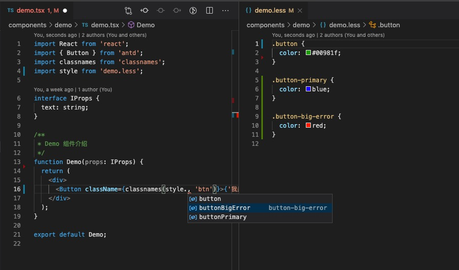

# css-modules-intellisense

css modules 智能提示。引入样式文件后，通过引入对象可"."出样式文件内对应的类名。

## 效果



## 特性

- 支持 import 与 require 样式文件导入方式；
- 含“-”链接的类名会自动转成驼峰式，需要配合 css-loader 中的 exportLocalsConvention: 'camelCase' 选项使用；
- 支持路径别名配置；

## 用法

安装后直接使用。如果项目涉及路径别名配置（如：webpack.resolve.alias）并且引入样式文件时有使用别名则必须先配置别名映射关系。

## 配置

目前支持两个配置项，都是关于别名配置的。

### css-modules-intellisense.alias

应用级别名配置，通过 vscode 中的 settings.json 进行配置。

别名映射地址必须使用 ${workspaceRoot} 开头，用户插件获取映射地址的绝对路径。

```
{
  "css-modules-intellisense.alias": {
    "@": "${workspaceRoot}/components"
  }
}
```

### css-modules-intellisense.selected

控制点击类名跳转后是否选中类名，默认值：false。
选中类名是为了便于搜索，跳转自动选中类名后，通过 command+f 可以快速在当前文件搜索此类名。

### css-modules-intellisense.configPath

用于当前项目插件配置文件路径指向，默认指向项目根节点的 cmconfig.json 文件。
可通过当前选项进行调整。（注意：配置文件必须是 json 格式！）

```
{
  "alias": {
    "@": "${workspaceRoot}/components"
  },
  "selectedClassname": true
}
```

此处别名映射的路径可以使用 ${workspaceRoot} 开头，也可以使用相对地址。
